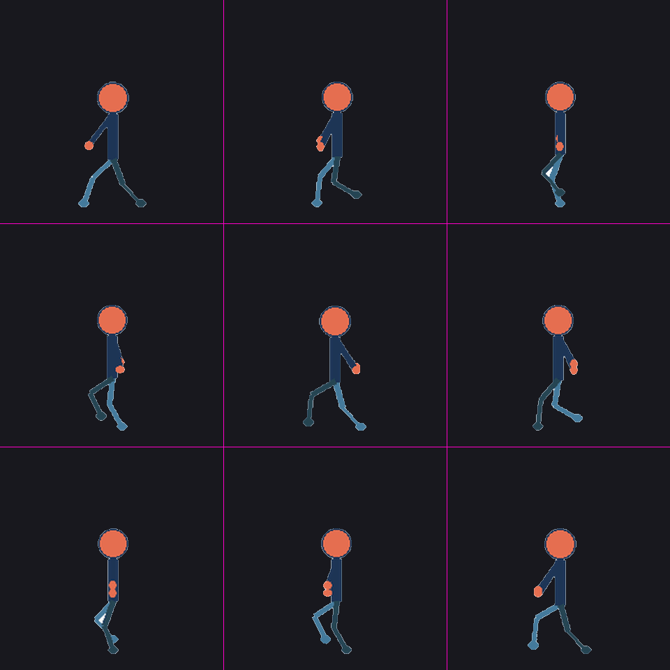

# Gifkit

**把网格角色分镜表（sprite sheet）整理成干净的循环 GIF。** 两种用法：

| 模式 | 承诺的能力 |
|---|---|
| **图形界面（默认路径）** | 等间距网格切帧、自动抠底、网格检测/手动指定、切割预览、地线对齐、统一调色板、循环 GIF 导出 |
| **命令行高级案例** | 配置驱动的动作编排：光流中割补帧、停顿节奏、24fps 网格排布、分析校验工具 |

核心完全离线，不依赖任何在线服务；代码以 MIT 许可发布。
[walker 示例](examples/walker/README.md)随仓库即可运行；内置的 Mimo 案例配置展示
真实生产用法（其图像素材**不随仓库分发**，见[许可证与素材](#许可证与素材)）。

## 快速开始（图形界面，推荐）

需要 Python ≥3.10（本机仅在 3.13 验证过）：

```bash
pip install -e .        # editable 安装，尚无 PyPI 包
gifkit gui
```

窗口就一个页面：选一张**排列整齐**的 sprite sheet → 点"一键生成 GIF" →
点"打开输出文件夹"。它会：

- 自动抠掉白底和假透明棋盘格；
- 自动检测行列数，也可以切到"手动指定"自己填——手动值**不会被检测结果覆盖**；
- **预览切割线**：生成前先看一眼每格的红色切割框，不贴合就调整；
- 画布按角色实际大小自动适配，脚底对齐同一条地线，构建日志实时滚动
  （抠底和网格检测也在后台线程，不会卡住窗口）。

各帧高度默认**保持原始尺寸**。若你的素材是 AI 生成的、同一角色有轻微大小漂移，
再改选"统一角色高度"——它会缩放每一帧到全表中位高度，蹲伏/跳跃类的真实
高低动作会被抹平。

不想装 Python：`pip install pyinstaller` 后
`python -m PyInstaller Gifkit.spec --noconfirm` 打出 `dist/Gifkit/`
免安装文件夹（双击 `Gifkit.exe`）。

## 快速开始（命令行，随仓库可复现）

```bash
pip install -e .
python examples/walker/make_material.py    # 确定性生成示例素材（不随仓库分发）
gifkit build --case walker_loop            # 12fps 步行循环，产物在 runs/
python verify.py runs/<运行目录>/walker_loop.gif --bg dark   # 回读拼图校验
```



## 高级：配置驱动的补帧流程

逐格摆拍式 sheet 直接播放一顿一顿。这条路径在关键帧之间
**沿光流估计的运动轨迹合成中间帧**（双向稠密光流 + 全局位移预补偿 +
预乘 Alpha 变形；是估计值而非"真实轨迹"，原图未表达的遮挡无法凭空恢复，
大跨度姿势建议加关键帧而不是补帧）：

- **节奏设计**：关键帧停顿（dramatic beats）单独保留，运动帧落在 1/fps 网格上。
  GIF 帧时长按 10 ms 量化，取整误差在网格内消化，不保证任意目标帧率都精确命中。
- **人工艺术选择保留在配置里**：每个转场补几帧、哪里停顿停多久、用哪个姿势——
  这些是动画判断，不交给算法猜。它们住在 `cases/*.json`，不在代码里。
- **校验内建**：GIF 回读拼图（白/棋盘/深色背景）、相邻帧轮廓 IoU 与光流连贯性
  度量、色彩保真 MAE。默认只检测报告，不自动"修复"。

```bash
gifkit cases                        # 列出内置案例
gifkit build --case mimo_v4         # 20 帧格斗连段（需本地 Mimo 素材）
gifkit build --config my_case.json --out path/to/out   # 换自己的素材：写一份配置即可
```

> `mimo_*` 案例引用的图像素材不随仓库分发（见文末）。在完整工作副本里可直接
> 构建；否则把配置指向你自己的素材即可。工作原理图与实现位置见下。

```
sprite sheet ──分割/对齐──▶ 关键帧序列 ──连贯性分析──▶ 转场计划(停顿+补帧数)
                                │                          │
                                └──────▶ 光流中割 + 节奏排布 + 统一调色板 ◀┘
                                                    │
                                              GIF(白底/透明/小图) ──▶ 回读校验
```

关键实现都在 `v2/morph.py`（中割库）与各构建脚本的纯函数里；
人工选择（PLAN/NB/HOLD、帧序挑选）全部在 `cases/`。

## 内置案例

**随仓库可运行**（素材由脚本确定性生成）：

| 案例 | 配置 | 内容 |
|---|---|---|
| `walker_grid` / `walker_loop` | [examples/walker](examples/walker/README.md) | 3×4 网格表 / 白底瓦片两条路径的 12fps 步行循环 |

**配置示例**（展示真实生产用法；图像素材不随仓库分发）：

| 案例 | 内容 |
|---|---|
| `mimo_v1` | 4×4 网格表，16 个独立姿势循环 |
| `mimo_v2_key` / `mimo_v2_24fps` | 16 关键帧：纯关键帧版 / 68 帧 24fps 连击循环 |
| `mimo_v3` | 72 张中割瓦片装配的枪械 38 帧 + 格斗 14 帧两条循环 |
| `mimo_v4` | 20 帧深度优化连段 |

历史产物清单与 v1→v4 的演进指标见 [docs/mimo-history.md](docs/mimo-history.md)。

## 能力清单

**已实现**（有测试与重建证据）：
配置驱动构建（5 类案例）、`gifkit build/cases/gui` CLI、GUI 全流程后台化 +
切割预览 + 手动网格模式、光流中割库（内容寻址缓存）、24fps 网格排布、
统一调色板 + 透明索引、9 个验证/分析工具（含深色背景检查）、
全部入口导入无副作用、材质边界显式报错（空帧/越界/超尺寸）、
自动化测试（见下）。

**规划中**（未实现，勿当事实引用）：PyPI 安装、`gifkit verify` 子命令、
多格式输出（APNG/WebP）、AI 补帧插件接口、封闭白底区域检测报告、
边缘修复、综合质量评分、GPU 加速、多 Python 版本/干净环境安装验证。

**实验性**：`evaluate_schemes.py` 的 IoU 评分选方案——轮廓重合度只是平滑度的
粗略代理，跳跃、停顿、快速出拳可能是有意的动作，不要盲信指标（见已知限制）。

## 已知限制

- 透明 GIF 在深色背景上有 1–2px 浅色镶边（白底素材半透明边缘的混色，
  历史成品相同；对比拼图保存在本地工作树，不随仓库分发）。
- 瓦片路径的边界洪填充抠底无法移除四肢围出的**封闭**白色区域。
- 光流中割对大跨度姿势（IoU < 0.6）效果有限；此时应增加关键帧而非补帧。
- 仅验证过 editable 安装与 Python 3.13；GUI 仅在 Windows 上打包实测。

## 开发

```bash
python -B -m pytest tests/ -q -p no:cacheprovider --tb=short   # 约 4 秒
```

测试全部使用合成小图与临时目录，不重建动画、不触碰素材。完整工作副本全过；
**公开克隆上部分用例跳过**（依赖可生成示例素材，`python
examples/walker/make_material.py` 生成后即恢复）。

## 文档索引

| 文档 | 内容 |
|---|---|
| [docs/phase1-fixes.md](docs/phase1-fixes.md) | 正确性修复（调色板/路径/覆盖/缓存） |
| [docs/phase2-step1-io.md](docs/phase2-step1-io.md) … [step5](docs/phase2-step5-visual-and-second-case.md) | 工程化五步：IO 统一 → 入口拆分 → 配置抽取 → CLI/安装 → 视觉验证 |
| [docs/mimo-history.md](docs/mimo-history.md) | Mimo v1–v4 历史产物与指标 |
| [docs/publishing.md](docs/publishing.md) | 发布检查单与素材边界 |
| [examples/walker/README.md](examples/walker/README.md) | 第二套素材演示 |

## 许可证与素材

- **代码：MIT 许可**（见 [LICENSE](LICENSE)），2026 起。
- **Mimo 图像素材不随仓库分发、不在 MIT 许可范围内**：`mimo*.png`、`gpt_*.png`、
  各 `mimo*_*.gif` 及派生帧/拼图仅存在于本地工作副本（已被 .gitignore 排除）。
  案例配置（`cases/mimo_*.json`）只含时序与布局参数，随代码发布。
- 仓库历史已按素材不发布的原则重建（见 [docs/publishing.md](docs/publishing.md)），
  请勿向 git 历史添加素材文件。
